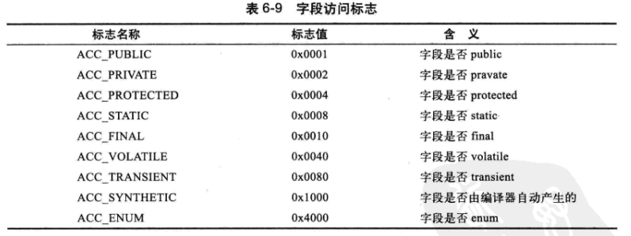

[TOC]

### Class类文件结构

class文件格式采用累死C语言结构体的伪结构来存储，**伪结构** 只有两种数据类型：**无符号数**和**表**

**无符号数**: 属于基本类型 u1,u2,u3,u4 表示 1，2，3，4个字节 。用来描述 数字，索引引用，数量值，按照UTF-8构成的字符串

**表**： 由数个无符号数或其他表构成的复合结构数据类型 以_info结尾

#### **常量池**:

常量池中每一个常量都一个表 共11种结构各不同的表结构。这些表都有一个共同特点 第一个u1类型的标志位 代表这个常量属于那种常量类型(取值1-12 缺2)

11种数据表结构

#### 访问标志

u2 用于识别一些类或接口层次的访问信息 具体标志信息如下

#### 类索引(this_class)、父类索引(supper_class)、接口索引集合(interfaces)

#### 字段表集合

field_count 、 _info(fields)

##### 字段表结构

##### access_flages:

##### name_index（字段简单名称）:

##### descriptor_index(字段和方法描述符):

#### 方法集合

##### 访问标志

##### 名称索引

##### 描述符索引

##### 属性表集合

#### 属性表集合

### 虚拟机类加载机制

其中 加载 验证 准备 初始化 卸载 这5个阶段顺序是确定的

#### **加载:**

- 通过一个类的全限定名来获取定义此类的二进制字节流

- 将字节流代表的静态存储结构转化为方法区运行时数据结构

- 堆中生成一个代表这个类的Class对象，作为方法区数据的访问入口

#### **验证**：

- 文件格式验证
- 元数据验证
- 字节码验证
- 符号引用验证

#### **准备：**

- 正式为类变量分配内存并设置类变量初始值(内存都在方法区中分配)，不包括实例变量

#### **解析：**

符号引用转直接引用

##### 类或接口的解析

##### 字段解析

##### 类方法解析

##### 接口方法解析

**初始化**：

只有下面四种情况类或接口才初始化

- 使用java.lang.reflet进行反射调用时，如果类没有初始化首先触发

- 使用 new、getstatic、putstatic、invokestatic(即实例化对象、读取类静态字段(final或编译期把结果放入常量池除外)、调用一个类的静态方法)

- 初始化一个类,如果父类没有初始化，则首先触发

- 程序主类

  <clinit>

#### 类加载器

**虚拟机角度** 启动类加载器(Bootstrap ClassLoader)和其他类加载器（java.lang.ClassLoader）

**开发角度**：启动类(Bootstrap ClassLoader)  扩展类(Extension ClassLoader)

应用程序类加载器(Application ClassLoader)

双亲委派模型：如果一个类加载器收到了类加载请求，它不会首先自己去尝试加载类，而是将请求委派给父类

### 虚拟机字节码执行引擎

静态多分派 动态单分派

### 类加载及执行子系统