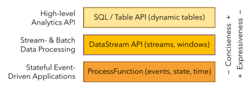

###应用支持
* 状态
* 时间
* 分层API

  * ProcessFunction:是 Flink 所提供的最具表达力的接口。ProcessFunction 可以处理一或两条输入数据流中的单个事件或者归入一个特定窗口内的多个事件。它提供了对于时间和状态的细粒度控制。开发者可以在其中任意地修改状态，也能够注册定时器用以在未来的某一时刻触发回调函数
  * DataStream API:为许多通用的流处理操作提供了处理原语。这些操作包括窗口、逐条记录的转换操作，在处理事件时进行外部数据库查询等
  * SQL & Table API:这两个 API 都是批处理和流处理统一的 API，这意味着在无边界的实时数据流和有边界的历史记录数据流上，关系型 API 会以相同的语义执行查询，并产生相同的结果。
* 库
  * 复杂事件处理(CEP)：模式检测是事件流处理中的一个非常常见的用例。Flink 的 CEP 库提供了 API，使用户能够以例如正则表达式或状态机的方式指定事件模式。CEP 库与 Flink 的 DataStream API 集成，以便在 DataStream 上评估模式。CEP 库的应用包括网络入侵检测，业务流程监控和欺诈检测。

  * DataSet API：DataSet API 是 Flink 用于批处理应用程序的核心 API。DataSet API 所提供的基础算子包括map、reduce、(outer) join、co-group、iterate等。所有算子都有相应的算法和数据结构支持，对内存中的序列化数据进行操作。如果数据大小超过预留内存，则过量数据将存储到磁盘。Flink 的 DataSet API 的数据处理算法借鉴了传统数据库算法的实现，例如混合散列连接（hybrid hash-join）和外部归并排序（external merge-sort）。

  * Gelly: Gelly 是一个可扩展的图形处理和分析库。Gelly 是在 DataSet API 之上实现的，并与 DataSet API 集成。因此，它能够受益于其可扩展且健壮的操作符

### 应用场景
* 事件驱动型应用:事件驱动型应用是一类具有状态的应用，它从一个或多个事件流提取数据，并根据到来的事件触发计算、状态更新或其他外部动作。
* 数据分析应用:数据分析任务需要从原始数据中提取有价值的信息和指标。传统的分析方式通常是利用批查询，或将事件记录下来并基于此有限数据集构建应用来完成。
* 数据管道应用:提取-转换-加载（ETL）是一种在存储系统之间进行数据转换和迁移的常用方法。ETL 作业通常会周期性地触发，将数据从事务型数据库拷贝到分析型数据库或数据仓库。

### API
* DataSet
* DataStream

### 程序解析
* 配置获取环境上下文(Obtain an execution environment)
* 加载/创建初始数据(Load/create the initial data)
* 执行数据转换(Specify transformations on this data)
* 指定计算结果存放位置(Specify where to put the results of your computations)
* 触发执行程序(Trigger the program execution)

### 数据类型
* Java Tuples and Scala Case Classes
* Java POJOs
* Primitive Types(java&scala原始类型)
* Regular Classes
* Values
* Hadoop Writables
* Special Types