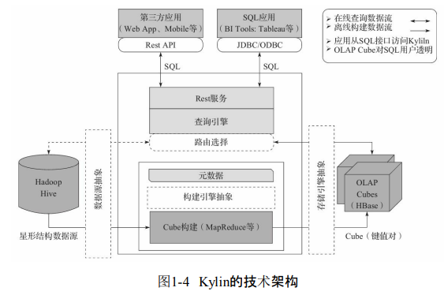

## Kylin

### 架构图

* 可扩展
* 主要特点(Apache Kylin的主要特点包括支持SQL接口、支持超大数据集、秒级响应、可伸缩性、高吞吐率、BI工具集成等)

### 基础概念
* Cube（或Data Cube），即数据立方体，是一种常用于数据分析与索引的技术；它可以对原始数据建立多维度索引。通过Cube对数据进行分析，可以大大加快数据的查询效率。
* Cuboid在Kylin中特指在某一种维度组合下所计算的数据。
* Cube Segment是指针对源数据中的某一个片段，计算出来的Cube数据。通常数据仓库中的数据数量会随着时间的增长而增长，而Cube Segment也是按时间顺序来构建的。

### Cube
#### Cube创建
#### Cube构建
* 全量构建
* 增量构建
* 流式构建